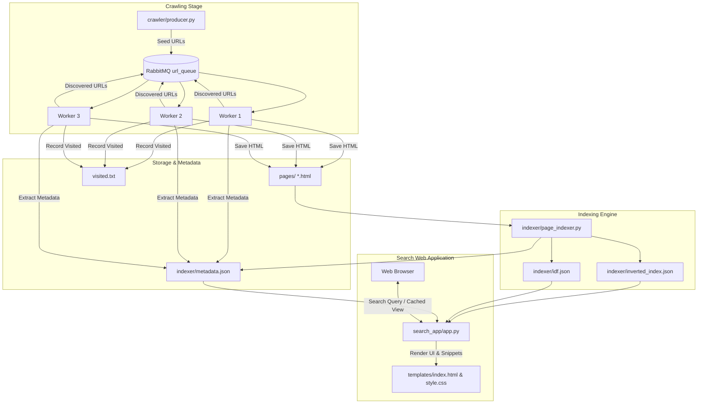

# 🕷️ WebScour – Distributed Web Crawler & Search Engine

WebScour is an end-to-end, high-performance **Python-based distributed web crawler and search engine** developed as part of the **Infosys Virtual Internship Program**.

The project implements the complete search engine lifecycle:
$$\textbf{Seed URLs} \longrightarrow \textbf{Distributed Crawling (RabbitMQ)} \longrightarrow \textbf{HTML Storage} \longrightarrow \textbf{Inverted Indexing (TF-IDF)} \longrightarrow \textbf{Search Engine Web App (Flask)}$$

---

## 📌 Implementation Status

| Component | Status | Details |
| :--- | :---: | :--- |
| **1. Crawling** | ✅ Completed | Distributed multi-process workers via RabbitMQ (`pika`), retry logic, same-domain filter |
| **2. Collecting** | ✅ Completed | Local HTML storage, UUID mapping, automatic metadata extraction (titles, canonical URLs) |
| **3. Indexing** | ✅ Completed | HTML cleaning, tokenization, stopword filtering, inverted index, smooth TF-IDF computation |
| **4. Searching** | ✅ Completed | Modern Flask UI, TF-IDF ranking with title boost, keyword snippet highlighting, dark/light mode |

---

## 🏗️ System Architecture



---

## 🧰 Tech Stack

- **Core Language**: Python 3.10+
- **Message Broker**: RabbitMQ & `pika` (Distributed task queue)
- **Web Scraping & Extraction**: `requests`, `beautifulsoup4`, `urllib.parse`
- **Concurrency**: Python `multiprocessing` with inter-process synchronization locks
- **Information Retrieval**:
  - Inverted Index (`inverted_index.json`)
  - Term Frequency & Inverse Document Frequency (Smooth TF-IDF)
  - Stopword filtering and title-match boosting
- **Web Application**: Flask (Python web microframework)
- **Frontend & Styling**: Modern Vanilla CSS, responsive design, CSS custom property themes (Dark & Light mode), and Google Fonts (`Plus Jakarta Sans` & `JetBrains Mono`).

---

## 📁 Directory Structure

```bash
WebScour/
├── crawler/
│   ├── producer.py          # Enqueues initial seed URLs into RabbitMQ
│   └── worker.py            # Multi-process crawler workers consuming from RabbitMQ
├── indexer/
│   ├── page_indexer.py      # Parses HTML, extracts metadata, builds inverted index & TF-IDF
│   ├── inverted_index.json  # Vocabulary posting lists with term frequencies
│   ├── idf.json             # Inverse Document Frequency weights
│   └── metadata.json        # Maps doc IDs to titles, canonical URLs, and excerpts
├── pages/                   # Storage directory for downloaded raw HTML snapshots
├── search_app/
│   ├── app.py               # Flask application with TF-IDF search, snippet generator, and view cache
│   ├── static/
│   │   └── style.css        # Modern, responsive stylesheet with dark/light mode
│   └── templates/
│       └── index.html       # Search UI template with query metrics and cached snapshots
├── visited.txt              # Deduplication registry of visited URLs
├── milestone1.pdf           # Internship milestone documentation
└── README.md                # Project documentation
```

---

## ⚙️ How It Works

### 1. Distributed Crawling (`crawler/`)
- `producer.py` initializes a durable queue `url_queue` on RabbitMQ and publishes initial seed URLs (e.g. Wikipedia articles).
- `worker.py` spawns multiple worker processes (configurable, default: 3).
- Each worker:
  - Fetches the assigned URL with custom User-Agent and up to 3 retries.
  - Generates a unique UUID and saves the raw HTML in `pages/`.
  - Extracts metadata (page title, canonical URL, first paragraph excerpt) and records it to `indexer/metadata.json`.
  - Normalizes hyperlinks, filters out invalid schemes (`mailto:`, `javascript:`, `#`, `tel:`), enforces **same-domain restrictions**, checks `visited.txt` with process locks, and publishes newly discovered URLs back to RabbitMQ.

### 2. Text Processing & Inverted Indexing (`indexer/`)
- `page_indexer.py` iterates through all stored HTML pages in `pages/`.
- Decomposes non-content tags (`<script>`, `<style>`, `<noscript>`).
- Normalizes punctuation, lowercases tokens, and removes English stopwords.
- Computes **Term Frequency (TF)** for each document and builds the **Inverted Index**:
  $$\text{inverted\_index}[\text{term}] = [[\text{doc\_id}, \text{tf}], \dots]$$
- Computes **Smooth Inverse Document Frequency (IDF)**:
  $$\text{IDF}(t) = \ln\left(\frac{N + 1}{\text{DF}(t) + 1}\right) + 1.0$$
- Writes `inverted_index.json`, `idf.json`, and `metadata.json` to disk.

### 3. Search Application (`search_app/`)
- Loads inverted index, IDF tables, and document metadata into memory on startup.
- Computes relevance score:
  $$\text{Score}(D, Q) = \sum_{t \in Q} \text{TF}(t, D) \times \text{IDF}(t) \times \text{Boost}_{\text{title}}$$
- Generates dynamic excerpts with `<mark>` tags around matching query terms.
- Serves:
  - `GET /` — Search home page & query interface.
  - `GET /?q=...` — Search results with query response time in milliseconds.
  - `GET /view/<doc_id>` — Cached snapshot viewer of any crawled document.
  - `GET /api/search?q=...` — Programmatic JSON API endpoint.

---

## ▶️ Setup & Execution Guide

### Step 1: Install Dependencies
```bash
pip install requests beautifulsoup4 pika Flask
```

### Step 2: Set Up & Start RabbitMQ
Make sure RabbitMQ is running on your system (see the RabbitMQ Setup section below).

### Step 3: Run the Crawler
In separate terminal windows:
```bash
# Terminal 1: Seed initial URLs into RabbitMQ
python crawler/producer.py

# Terminal 2: Start multi-process crawling workers
python crawler/worker.py
```

### Step 4: Index the Crawled Pages
Once pages are collected in `pages/`, generate the inverted index and metadata:
```bash
python indexer/page_indexer.py
```

### Step 5: Launch the Search Web Interface
```bash
python search_app/app.py
```
Open your browser and navigate to:
```
http://127.0.0.1:5000
```

---

## 🐇 RabbitMQ Setup Guide for Windows

RabbitMQ requires **Erlang/OTP** and the **RabbitMQ Server**.

### Method 1: Using Chocolatey (Recommended - Fastest)
If you have Chocolatey installed, run PowerShell as Administrator:
```powershell
choco install erlang -y
choco install rabbitmq -y
```

### Method 2: Manual Installer
1. **Download and install Erlang/OTP (64-bit)**:
   - [Erlang Official Downloads](https://www.erlang.org/patches/otp-26.2.2) (Install first as Administrator).
2. **Download and install RabbitMQ Server**:
   - [RabbitMQ Windows Installer (.exe)](https://github.com/rabbitmq/rabbitmq-server/releases)
3. **Enable RabbitMQ Management Web Dashboard**:
   Open Command Prompt / PowerShell as Administrator and run:
   ```cmd
   cd "C:\Program Files\RabbitMQ Server\rabbitmq_server-*\sbin"
   rabbitmq-plugins enable rabbitmq_management
   ```
4. **Start the RabbitMQ Service**:
   ```cmd
   rabbitmq-service start
   ```
5. Open `http://localhost:15672` in your browser. Default login: `guest` / `guest`.

---

## 🎓 Internship Project Information

- **Program:** Infosys Virtual Internship
- **Project Title:** WebScour – Distributed Web Crawler & Search Engine
- **Domain:** Python / Web Technologies / Information Retrieval
- **Author:** Kunal Kushwaha
